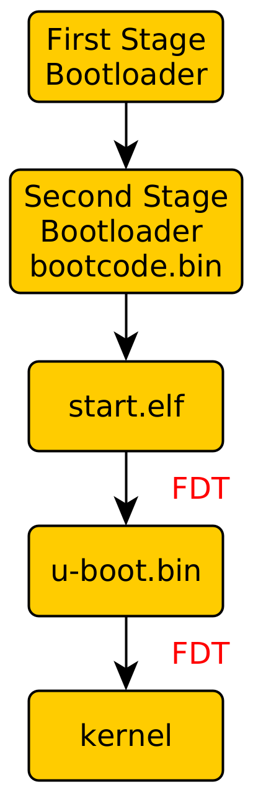
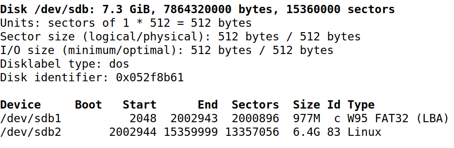
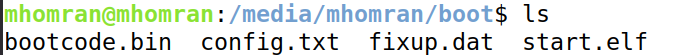
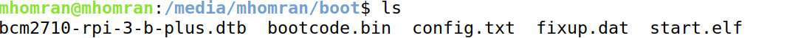
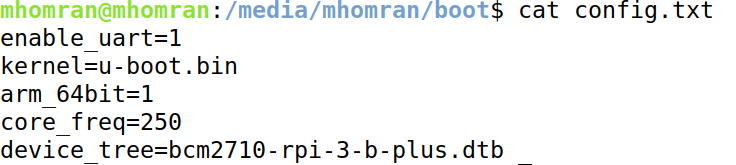
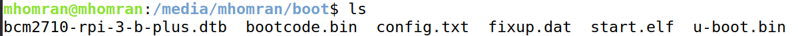
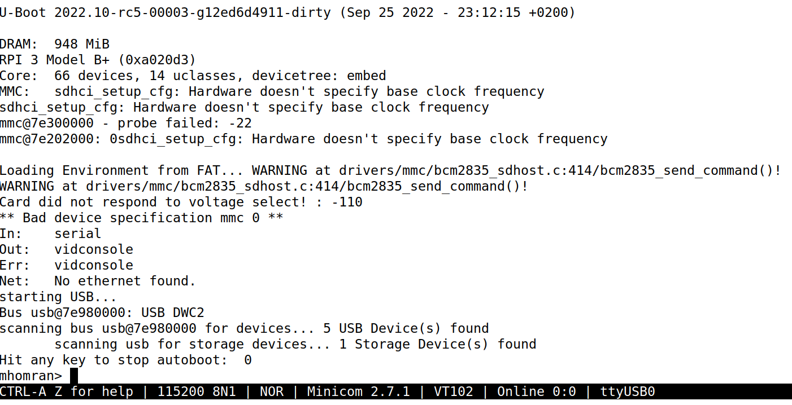
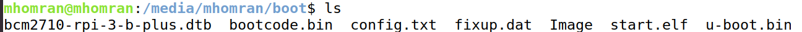
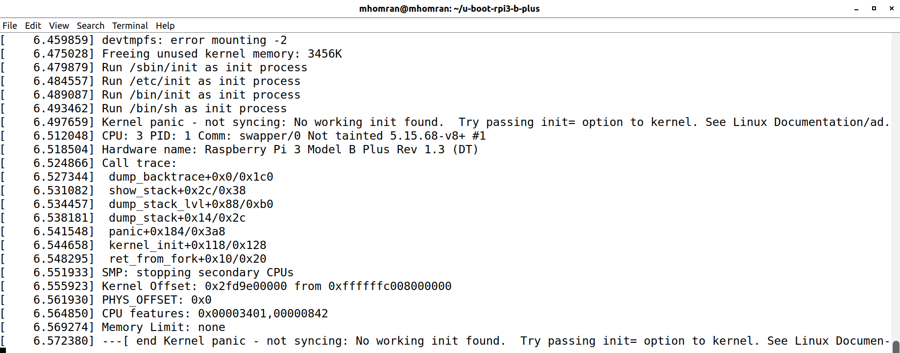
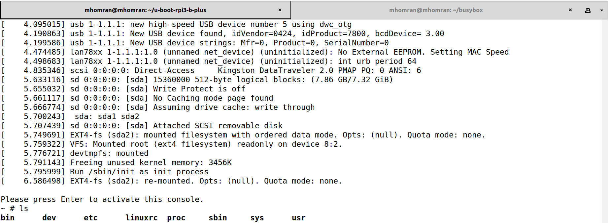

# About

In this repository, I will demonstrate how to boot a 64-bit kernel using u-boot and busybox. I struggled to find a complete guide to make me able to do that. I did some reverse engineering on a working system to understand what I'm supposed to do to boot my custom kernel. So I will try to show that in detail with some screen shots. My purpose is to make things easy for everyone else to build their own kernel without hassle. 

I use a USB drive to boot my custom kernel and not an SD card. A USB drive is much easier for you to remove and plug back in again. Luckily, rpi3b+ can boot from a USB drive without any necessary configuration. All you just need to do is to unplug the SD card if it exists.

# Raspberry pi boot process

First, the ROM bootloader starts and loads the second bootloader in the L2 Cache. Then, the second bootloader `bootcode.bin` starts and enables SDRAM and loads `start.elf`. After that, `start.elf` starts and makes a Flattened Device Tree (FDT) using the device tree binary .dtb in the boot folder and applies overlays that're written in `config.txt`.

It's important to mention how to apply a device tree overlay when it comes to raspberry pi. `u-boot` uses a library called `libfdt` to deal with device trees and apply overlays to them. Unfortunately, raspberry pi device trees don't follow the standard that this library uses. So, whenever I tried to apply an overlay, it always fails with `FDT_ERR_NOTFOUND`.

To get over this problem, we can <b>reuse</b> the same `FDT` offered by `start.elf` and make u-boot pass it to the kernel. This will allow us to enable whatever overlays we want by writing their names in `config.txt`. The downside of this method is that we always need to provide the device tree in the boot directory. So, it can't be downloaded from an FTB server, for example.

# 1- Prepare your USB drive

Your USB drive should have two partitions. One should be in `FAT` format. Usually, it's called `boot`. This filesystem will hold the kernel files, the bootloaders, device trees, and overlays. Another one can be in ext4 format. This one holds the linux file system. It's usually called `rootfs`. The file system size should be large enough to hold the content in it.

You can partition your USB drive using either the Ubuntu Disks utility or `fdisk` command. There are plenty of sources out there to show you how to partition your drive.

This is my USB drive partitions.

# 2- Vendor-specific bootloaders and files

There are vendor-specific files that should exist in the `boot` filesystem. These files are:

1. `boocode.bin`: this is the bootloader, which is loaded by the SoC on boot, does some very basic setup, and then loads the `start.elf` file.
1. `start.elf`: its job is to combine overlays with an appropriate base device tree, and then to pass a fully resolved Device Tree to u-boot.
1. `config.txt`: Contains many configuration parameters for setting up the Raspberry Pi.
1. `fixup.dat`: This is a linker file.

Those files can be found in the firmware repository of raspberry pi <a href="https://github.com/raspberrypi/firmware/tree/master/boot">here</a>.

# 3- Build a Device Tree Binary (DTB)

u-boot expects a flattened device tree (FDT) from the start.elf bootloader. The start.elf bootloader needs a device tree binary.dtb file to turn it into an FDT and pass it to u-boot. At this moment, we don't have one. So, we need to compile a device tree source first.

1. We need to clone the Linux kernel. We have two options. The first option is to clone the Linux repository and start configuring the kernel without any default configuration. This is a lot of work. The second option, which I chose, is to clone the Linux kernel maintained by the Raspberry Pi because it provides a default configuration to start from.

    The kernel repository can be found <a href="https://github.com/raspberrypi/linux">here</a>. You can just run 

    `git clone https://github.com/raspberrypi/linux --depth=1`

    `--depth=1` makes sure that we don't get the whole linux repository history which is so big and not useful for our case. We just need the latest tag.

1. We need to have the cross compiler `aarch64-linux-gnu-`
you can install it on ubuntu using this command:

    `sudo apt-get install gcc-aarch64-linux-gnu`

1. Configure the linux kernel using this command:

    `make bcmrpi3_defconfig ARCH=arm64 CROSS_COMPILE=aarch64-linux-gnu-`

1. Compile the DTBs using this command:

    `make -j12 dtbs ARCH=arm64 CROSS_COMPILE=aarch64-linux-gnu-`

1. Move the compiled Device Tree Binary file to the boot filesystem. You can find it under 

    `arch/arm64/boot/dts/broadcom/bcm2710-rpi-3-b-plus.dtb`

<b>Note</b>: I found that this device tree is the most compatible one with the overlays. I tried others like bcm2837.

# 4- Configure the raspberry pi through `config.txt`

Your `config.txt` should have these lines:

- `enable_uart=1` is basically enabling the the uart to be used by `u-boot.bin`

- `kernel=u-boot.bin` gives the kernel name to be loaded which is `u-boot.bin` in our case.

- `arm_64bit=1` forces the kernel loading system to assume a 64-bit kernel, starts the processors up in 64-bit mode.

- `core_freq=250` Frequency of the GPU processor core in MHz.

- `device_tree` specifiy the name of the `.dtb` file to be loaded.

# 5- `u-boot.bin` build

1. clone `u-boot` repository

    `git clone https://github.com/u-boot/u-boot --depth=1`

1. set the rpi3b+ default configuration

    `make rpi_3_b_plus_defconfig ARCH=arm CROSS_COMPILE=aarch64-linux-gnu-`

1. Make further configuration

    `make menuconfig ARCH=arm CROSS_COMPILE=aarch64-linux-gnu-`

    - Save fdt address, passed by the previous bootloader `start.elf`, to env vat `prevbl_fdt_addr` you can find it here:
        
        `Boot options->Save fdt address`

    - Change the Shell prompt to my username, you can find it here:

        `Command Line Interafce->Shell Command`
    
    - Increase the autoboot delay to 20 seconds so that we can have enough time to interrupt the autoboot, you can find it here:

        `Boot options->Autoboot options->delay`
    

1. Build `u-boot`

    - There's an issue I found when I tried to build `u-boot` which is multiple definitions of the function `save_boot_params`. I could get over this by deleting the implementation in board/raspberrypi/rpi/lowlevel_init.S.

    - Now you can run:

        `make -j12 ARCH=arm CROSS_COMPILE=aarch64-linux-gnu-`

    - Move `u-boot-bin` to the boot filesystem

    

    - Plug the usb drive into the raspberry pi. At this point, the u-boot should boot successfully.

u-boot is bootloaded !

# 6- Building the kernel

In step 3, we just built the device tree binaries. There are two more steps to build our custom kernel:
    
1. Configure the kernel with this command:

    `make menuconfig ARCH=arm64 CROSS_COMPILE=aarch64-linux-gnu-`

1. build the kernel with this command:

    `make -j12 Image ARCH=arm64 CROSS_COMPILE=aarch64-linux-gnu-`

1. Move the Image to the boot filesystem. You can find it under:
   
    `arch/arm64/boot/Image`

Note: for 64bit kernel, there's no option for making a compressed image e.g. zImage

Note: you can setup a trivial ftp server and grap the image from the host machine. (to be discussed later)

# 6- Booting the kernel and the `bootargs`

For u-boot to be able to boot the kernel, it should have the kernel and the device tree binary address. The kernel expects some boot arguments. Boot arguments configure things in the kernel. For u-boot to be able to pass the boot arguments, we need to put them in an environment variable `bootargs` using the command `setenv`.

Now let's consider booting the kernel step by step:

1. Turn your raspberry pi on and let u-boot starts and interrupt the autoboot by pressing any key.
1. You should load the kernel into the RAM. You can run this command in u-boot:

`fatload usb 0 ${kernel_addr_r} Image`
1. We have the address of the binary tree binary given to u-boot store in `prevbl_fdt_addr`. So, we don't need to load any DTB.
1. We need to specify the bootargs. You can run:

`setenv bootargs "8250.nr_uarts=1 root=/dev/sda2 rootwait console=ttyS0,115200n8"`

`8250.nr_uarts=1` specifies the number of serial ports supported. In our case, it's one serial port `ttyS0`.

`root=/dev/sda2` specify the partition of the root filesystem.

`rootwait` Wait (indefinitely) for the root device to show up. Useful for devices that are detected asynchronously (e.g. USB and MMC devices).

`console=ttyS0,115200n8` tells the kernel to start a console for us on the serial port `ttyS0` with the baudrate of 115200 with no parity and the data size is 8 bytes.

1. Now, we're ready to boot our kernel using the command:

`booti ${kernel_addr_r} - ${prevbl_addr_r}`

If you got something like that, then you booted the kernel successfully. The last message indicates that there's no init file, which should exist in the root filesystem at /sbin/init. In the next section, we'll make it using `busybox`.

reference:
https://www.kernel.org/doc/html/v4.14/admin-guide/kernel-parameters.html

# 7- Build the filesystem

We'll use <a href="https://busybox.net/">busybox</a> to build the root filesystem. 

1. Clone the repository:
    `git clone https://github.com/mirror/busybox`

1. We don't need a default configuration, so we'll skip this step.

1. We can start configuring using this command:

    `make menuconfig`

    - Make the a static binary (no shared libs). We can find that option under 

    `settings->Build Static Binary`

    - Determine the cross compiler. You can find it under this option:

    `settings->Cross compiler prefix`

    <b>IMPORTANT NOTE:</b> I tried passing  CROSS_COMPILE=aarch64-linux-gnu- to `make menuconfig` but it didn't consider it. I just found it after I tried to use the filesystem and it didn't work. Be careful and determine it after running `make menuconfig`.

1. Build the busybox using this command:

    `make -j12`

1. Install the filesystem using this command:

    `make install`

    The installed filesystem could be found in `./_install` folder. Copy it to the filesystem partition.

1. Make the `rcS` script that will remount the filesystem as read/write and do other stuff.

    `mkdir _install/etc`

    `mkdir _install/etc/init.d`

    `vi _install/etc/init.d/rcS`

    copy this and paste it in the `rcS` file
    
    <code>
    #!/bin/sh
    
    mount -t proc none /proc
    
    mount -o remount,rw /
    
    mount -t sysfs none /sys
    
    echo /sbin/mdev > /proc/sys/kernel/hotplug
    
    mdev -s
    </code>

    Make it excutable

    `chmod +x _install/etc/init.d/rcS`

1. Create important folders:
    
    `mkdir _install/proc`

    `mkdir _install/sys`
    
    `mkdir _install/dev`

1. Copy _install to the root filesystem partition

    `cp -r _install/* /media/mhomran/rootfs`

Plug in the USB drive into the raspberry pi and start the kernel by doing step #6 once more.

My root filesystem !
